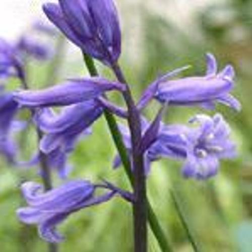
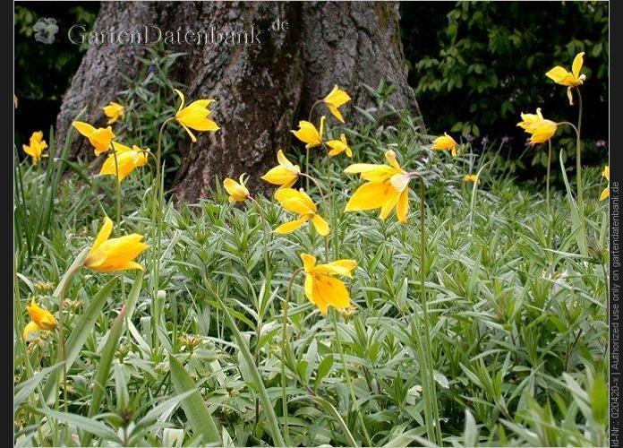
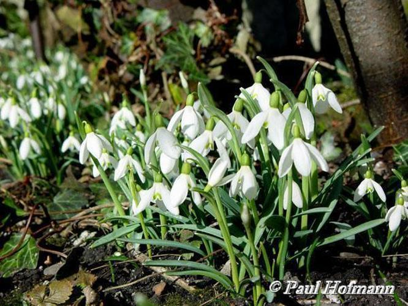
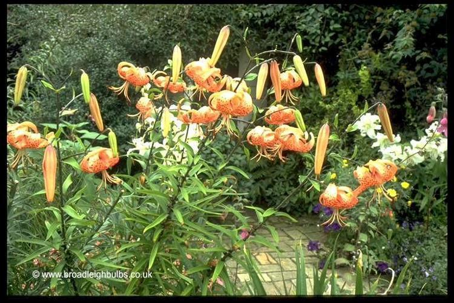
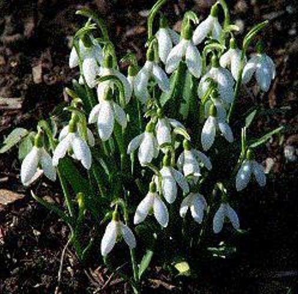

# Assignment 1 - Building a simple image search algorithm

## Github repo link 

This assignment can be found at my github [repo](https://github.com/ameerwald/cds_vis_exam_assignment1).

## The data

The dataset is a collection of over 1000 images of flowers, sampled from 17 different species. The dataset comes from the Visual Geometry Group at the University of Oxford, and full details of the data can be found [here](https://www.robots.ox.ac.uk/~vgg/data/flowers/17/).

## Assignment description

For this assignment, we were asked to use  ```OpenCV``` to design a simple image search algorithm. The criteria are as follows:

- Define a particular image to work with 
- For that image
  - Extract the colour histogram using ```OpenCV```
- Extract colour histograms for all of the **other* images in the data
- Compare the histogram of the chosen image to all of the other histograms 
  - For this, use the ```cv2.compareHist()``` function with the ```cv2.HISTCMP_CHISQR``` metric
- Find the five images which are most similar to the target image
  - Save a CSV file to the folder called ```out```, showing the five most similar images and the distance metric:

|Filename|Distance]
|---|---|
|target|0.0|
|filename1|---|
|filename2|---|


## Repository 

| Folder         | Description          
| ------------- |:-------------:
| Data      | The flowers dataset      
| Notes  | Jupyter notebook with notes, used to create .py script  
| Out  | List of the 5 most similar flowers to my chosen flower in a .csv file     
| Src  | Py script for the image search algorithm  
| Utils  | Taken from class notebook, using two functions to show images 

## To run the scripts 

1. Clone the repository, either on ucloud or something like worker2
2. From the command line, at the /cds_vis_exam_assignment1/ folder level, run the following lines of code. 

This will create a virtual environment, install the correct requirements.
``` 
bash setup.sh
```
While this will run the scripts and deactivate the virtual environment when it is done. 
```
bash run.sh
```

This has been tested on an ubuntu system on ucloud and therefore could have issues when run another way.

## Discussion of Results 
In the ```out``` folder is a .csv file with this table. Shows the file name of the most similar images which is based on their chi value, with smaller values indicating increased similarity.    
|File|Chi|
|---|---|
|image_0621.jpg|208.85|
|image_0139.jpg|224.83|
|image_0550.jpg|229.79|
|image_1298.jpg|232.57|
|image_0142.jpg|233.88|


Here is the original flower I picked, I believe it is a bluebell or wild hyacinth. 


Here are the 5 most similar images apparently.

<table>
  <tr>
    <td align="center">
      
      <br>
      <b>Wild Tulip</b>
    </td><td align="center">
      
      <br>
      <b>Snowdrop</b>
    </td><td align="center">
      
      <br>
      <b>Tiger lily</b>
    </td><td align="center">
      
      <br>
      <b>Voilet</b>
    </td><td align="center">
      
      <br>
      <b>Snowdrop</b>
    </td>
  </tr>
</table>


From these images it appears that this image search is not very accurate, at least compared to how people would categorize similar flowers. 